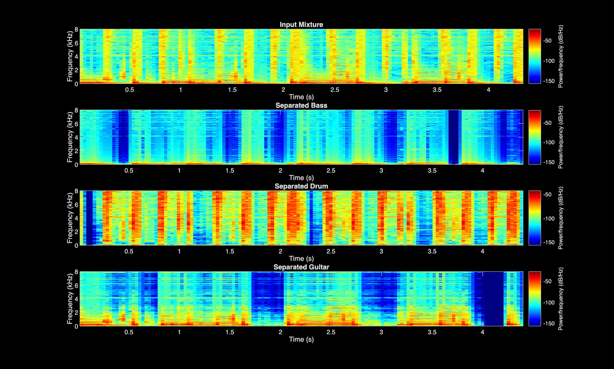

#  Blind Audio Source Separation using STFT and NMF

## 📌 Project Overview

This project implements **blind audio source separation** using a custom Short-Time Fourier Transform (STFT) and Non-Negative Matrix Factorization (NMF) in MATLAB.

A mixed drum and bass audio signal is decomposed into its individual components by factorizing the magnitude spectrogram into spectral bases and temporal activation matrices.

The system performs complete end-to-end processing:
- Time-frequency analysis  
- Matrix factorization  
- Signal reconstruction  

---

## 🎯 Objectives

- Implement a custom STFT for time-frequency analysis  
- Apply NMF for unsupervised source separation  
- Reconstruct separated signals using inverse STFT  
- Analyze effectiveness of blind matrix decomposition  

---

##  Technical Background

### 1️⃣ Short-Time Fourier Transform (STFT)

STFT converts a time-domain signal into its time-frequency representation:

X(m, k) = Σ x[n] w[n - m] e^(-j2πkn/N)

Where:
- x[n] → input signal  
- w[n] → window function  
- m → time frame  
- k → frequency bin  

---

### 2️⃣ Non-Negative Matrix Factorization (NMF)

Given a non-negative matrix V (magnitude spectrogram):

V ≈ W H

Where:
- V → Magnitude spectrogram  
- W → Spectral basis matrix  
- H → Temporal activation matrix  

NMF enables separation of dominant spectral components without prior labeling (blind separation).

---

## ⚙️ Processing Pipeline

1. Load mixed audio signal (`Drum+Bass.wav`)
2. Compute magnitude spectrogram using custom STFT
3. Apply NMF using multiplicative update rules
4. Separate basis components
5. Perform inverse STFT
6. Reconstruct time-domain audio signals

---

## ▶ How to Run

1. Open MATLAB.
2. Navigate to the project directory.
3. Run:

   
The script will automatically:
- Perform STFT
- Apply NMF
- Reconstruct separated sources
- Save outputs in the `results/` folder.

---

## 📂 Repository Structure
audio-source-separation-using-nmf/
│
├── src/
│ ├── myspectrogram.m
│ ├── invmyspectrogram.m
│ ├── nmf.m
│ └── main_source_separation.m
│
├── audio/
│ └── Drum+Bass.wav
│
├── results/ 
│ ├── spectrogram.png
│ ├── separated_drum.wav
│ └── separated_bass.wav
│
└── README.md

---

##  Tools & Technologies

- MATLAB  
- Signal Processing Techniques  
- Fourier Transform  
- Linear Algebra  
- Matrix Factorization Algorithms  

---

## Results

### Separated Audio Outputs

- `bass.wav`  
- `drum.wav`  
- `guitar.wav`

### 📈 Spectrogram Comparison

The NMF-based decomposition successfully separates:

- Low-frequency harmonic structure → **Bass**
- Broadband percussive components → **Drum**
- Mid-frequency harmonic content → **Guitar**

---

## Future Improvements

- Sparse NMF implementation  
- Comparison with Independent Component Analysis (ICA)  
- Deep learning-based separation  
- Real-time embedded implementation  

---

## Author
Pranav Krishnakumar Iyer
Electronics and Communication Engineering Undergraduate  
Interested in:
- Signal Processing  
- Embedded Systems  
- Hardware-Software Integration  
